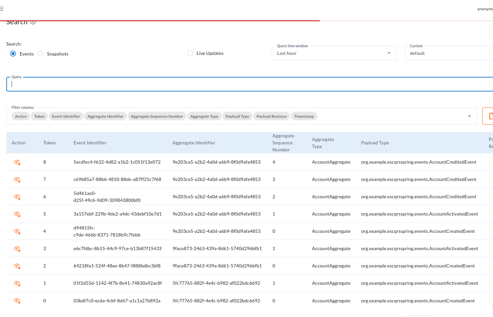
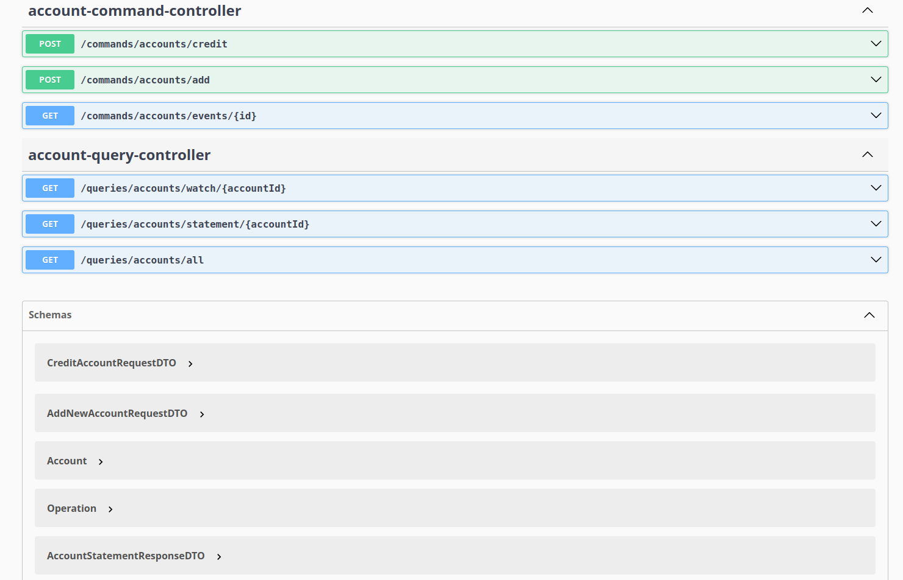

# Rapport de Projet : Event Sourcing & CQRS avec Spring Boot et Axon

*nom : jerrari*
*prenom : mountassir*
*filière: GLSID-3*

## Introduction
Ce projet a été réalisé dans le cadre d'un apprentissage approfondi des patterns **Event Sourcing** et **CQRS** (Command Query Responsibility Segregation). L'objectif est de concevoir un système de gestion de comptes bancaires robuste, scalable et auditable en utilisant le framework **Axon** et **Spring Boot**.

## Architecture du Système

### 1. Event Sourcing
Contrairement à une approche CRUD traditionnelle, l'état actuel d'un compte n'est pas stocké directement. Chaque modification (création, crédit, débit) est enregistrée sous forme d'un **événement** immuable dans un "Event Store". L'état du compte est reconstruit en rejouant ces événements.

### 2. CQRS
Le système est divisé en deux parties distinctes :
- **Command Side** : Gère les intentions de modification (Commands), valide les règles métier et génère les événements.
- **Query Side** : Gère la lecture des données. Il maintient une projection (Read Model) optimisée pour les consultations, mise à jour de manière asynchrone via les événements.

## Infrastructure

### Axon Server

Axon Server joue un rôle central dans cette architecture :
- **Event Store** : Il stocke de manière optimisée tous les événements générés par le système.
- **Message Broker** : Il assure le routage des commandes, des événements et des requêtes entre les différents composants du système.

### PostgreSQL
PostgreSQL est utilisé pour le **Read Model**. Les données y sont stockées sous une forme dénormalisée (entités JPA) pour permettre des requêtes de lecture rapides et complexes, sans impacter les performances de la partie écriture.

## Liste des APIs

### Commandes (Écriture)
| Méthode | Endpoint | Description |
| :--- | :--- | :--- |
| `POST` | `/commands/accounts/add` | Création d'un nouveau compte bancaire. |
| `POST` | `/commands/accounts/credit` | Créditer un montant sur un compte existant. |
| `GET` | `/commands/accounts/events/{id}` | Consulter l'historique brut des événements pour un compte. |

### Requêtes (Lecture)
| Méthode | Endpoint | Description |
| :--- | :--- | :--- |
| `GET` | `/queries/accounts/all` | Récupérer la liste de tous les comptes (Read Model). |
| `GET` | `/queries/accounts/statement/{id}` | Obtenir le relevé détaillé d'un compte spécifique. |
| `GET` | `/queries/accounts/watch/{id}` | Flux temps réel (SSE) des opérations sur un compte. |

## Conclusion
L'implémentation de ces patterns permet une séparation claire des responsabilités, une traçabilité totale grâce à l'Event Sourcing, et une performance de lecture optimisée via les projections PostgreSQL.
